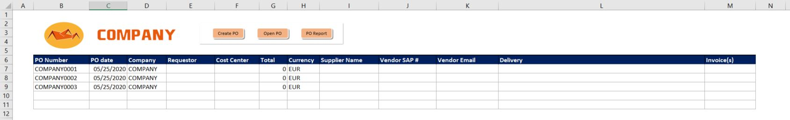

The script takes Purchase Request in excel format and converts it into Purchase Order printed into PDF file which is the final file to be sent over to a supplier. In the meantime, script saves and tracks down the request details in the main table for the further analysis or audits. Both Putchase Request and Purchase Order gets archived at the end of macro's work.

The script includes algorithm to generate the Purchase Order number (first tracker's column) so that it can be unique and not duplicate previous ones. This allows to avoid worst case scenario where we generate two different orders under one number.

miniERP excel handles also back-end dabase of vendors and ordering company data that is being printed on Purchase Order.

